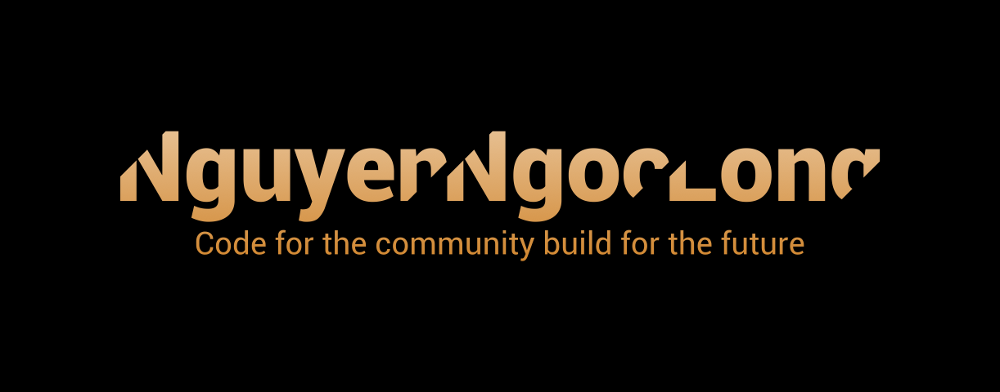

<!--  -->

<!-- Hello Message -->
<h3 align="center">
    <samp>
        &gt; Hey There!, I am <b><a style="text-decoration:none" target="_blank" href="https://nguyenngoclongdev.github.io/">Nguyen Ngoc Long</a></b>
    </samp>
</h3>
&nbsp;

<!-- Profile -->

    <samp>
        I'm a software developer from <b>Vietnam</b> 
        「 Code, Solve, Build - Across platforms, with Devops</b> 」 
    </samp>
     
    <!-- JavaScript -->
    
    <!-- Nodejs -->
    
    <!-- Python -->
    
    <!-- Typescript -->
    
    <!-- Java -->
    
    <!-- C# -->
    

<!-- Repositories -->

&nbsp;

<h2 align="center"><samp>Featured repositories</samp></h2>

    

<!-- Languages -->

&nbsp;

<h2 align="center"><samp>Used languages</samp></h2>

<!-- Reactions -->

&nbsp;

<h2 align="center"><samp>Overall users reactions</samp></h2>

<!-- Funding -->

&nbsp;

<h2 align="center"><samp>Buy Me a Coffee</samp></h2>

    <!-- KO-FI -->
    
    <!-- Paypal -->
    
    <!-- Patreon -->
    

<!-- Commits history -->

&nbsp;

<h2 align="center"><samp>Commits history</samp></h2>

<!-- Metrics -->

&nbsp;

<h2 align="center"><samp>Metrics</samp></h2>

<!-- Footer -->

&nbsp;

<h3 align="center"><samp>Made with ❤️ - 2023.</samp></h3>
